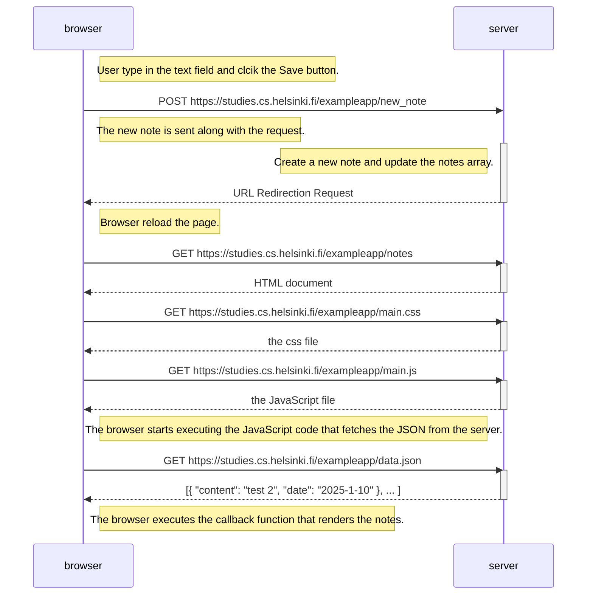
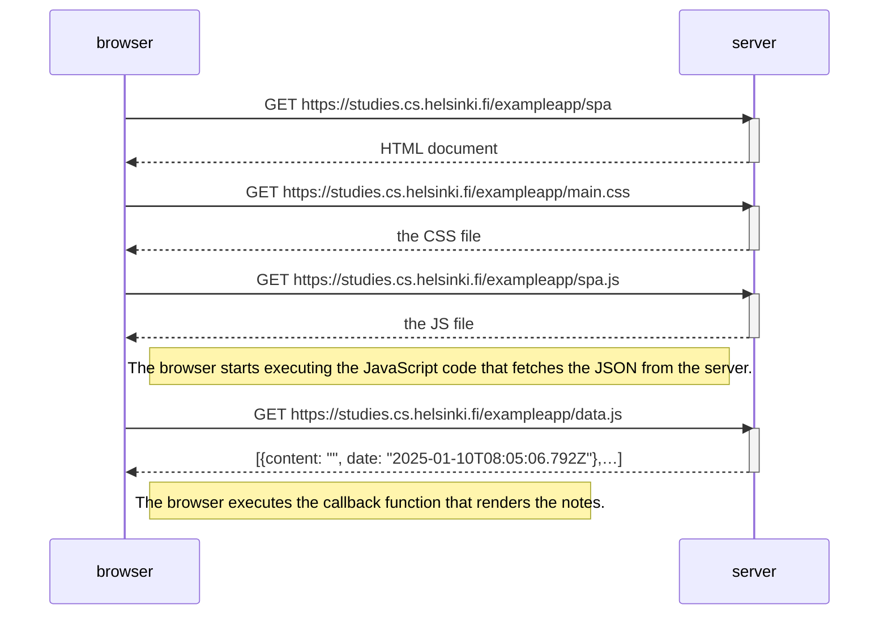
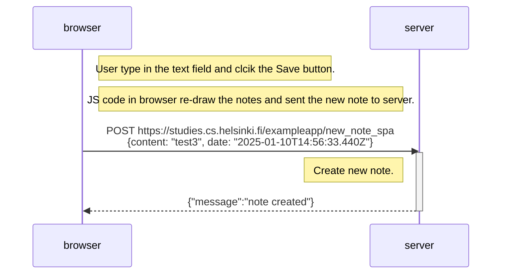

## Part 0: Exercises 0.1.-0.6

### Exercise 0.1

No submission needed.

### Exercise 0.2

No submission needed.

### Exercise 0.3

No submission needed.

###  Exercise 0.4 

###  Exercise 0.5 

###  Exercise 0.6 
